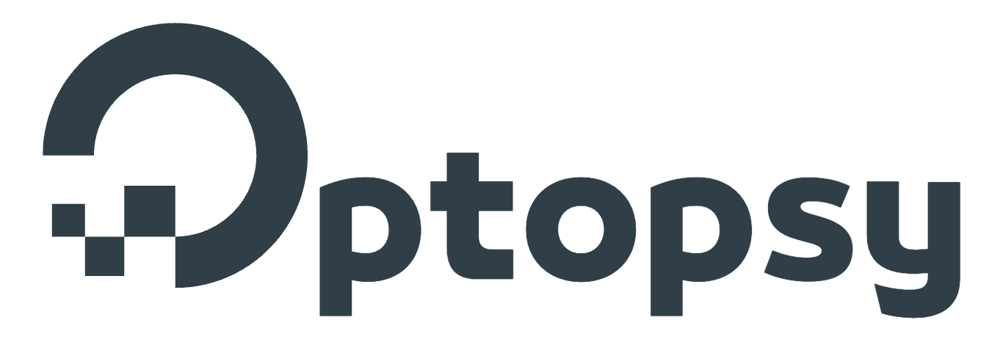
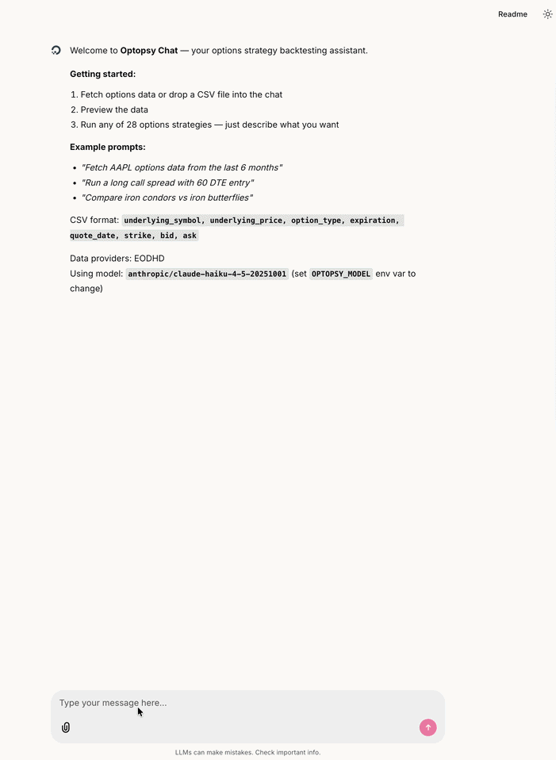

[](https://github.com/astral-sh/uv)
[](https://github.com/astral-sh/ruff)
[](https://github.com/astral-sh/ty)
[](https://github.com/michaelchu/optopsy/actions/workflows/ci.yml)
[](https://badge.fury.io/py/optopsy)
[](https://pepy.tech/project/optopsy)
[](https://pypi.org/project/optopsy/)



An AI-powered research and backtesting tool for options strategies.

Optopsy combines a Python backtesting engine with an optional conversational AI interface that fetches data from online or local sources, runs strategies, and interprets results — so you can go from *"How do 45-DTE iron condors on SPX perform with a 50% profit target and 2x stop loss vs holding to expiration?"* to detailed performance statistics in seconds, not spreadsheets.

[Full Documentation](https://michaelchu.github.io/optopsy/) | [API Reference](https://michaelchu.github.io/optopsy/api-reference/) | [Examples](https://michaelchu.github.io/optopsy/examples/)

## Features

- **38 Built-in Strategies** - From simple calls/puts to iron condors, butterflies, condors, ratio spreads, collars, calendars, and diagonals
- **Per-Leg Delta Targeting** - Select strikes by delta with `target, min, max` per leg
- **Trade Simulator** - Chronological simulation with capital tracking, position limits, and equity curves via `simulate()`
- **Portfolio Simulation** - Weighted multi-strategy portfolio backtesting via `simulate_portfolio()`
- **Early Exits** - Stop-loss, take-profit, and max-hold-days rules for automatic position management
- **Commissions** - Model broker fees with per-contract, base fee, and min fee structures
- **Risk Metrics** - Sharpe, Sortino, VaR, CVaR, Calmar, Omega, tail ratio, and more via `compute_risk_metrics()`
- **80+ Entry Signals** - Filter entries with TA indicators (RSI, MACD, Bollinger Bands, EMA, ATR, IV Rank) via [pandas-ta-classic](https://github.com/xgboosted/pandas-ta-classic)
- **Custom Signals** - Use `custom_signal()` to drive entries from any DataFrame with a boolean flag column
- **Slippage Modeling** - Realistic fills with mid, spread, liquidity-based, or per-leg slippage
- **Live Data Providers** - Fetch options chains and stock prices directly from supported data sources (e.g. EODHD)
- **Smart Caching** - Automatic local caching of fetched data with gap detection for efficient re-fetches
- **Plugin System** - Extend with custom strategies, signals, and data providers via entry points
- **AI Chat UI** - Interactive AI-powered chat interface with conversation starters, settings panel, and result caching

## AI Chat UI (Beta)

An AI-powered chat interface that lets you fetch data, run backtests, and interpret results using natural language.



### Setup & Configuration

Install the beta pre-release with the `ui` extra:

```bash
pip install --pre optopsy[ui]
```

Configure your environment variables in a `.env` file at the project root (the app auto-loads it):

```env
ANTHROPIC_API_KEY=sk-ant-...       # or OPENAI_API_KEY for OpenAI models
EODHD_API_KEY=your-key-here        # enables live data downloads (optional)
OPTOPSY_MODEL=anthropic/claude-haiku-4-5-20251001  # override the default model (optional)
```

At minimum you need an LLM API key (`ANTHROPIC_API_KEY` or `OPENAI_API_KEY`). Set `EODHD_API_KEY` to enable downloading historical options data directly from [EODHD](https://eodhd.com/). The `OPTOPSY_MODEL` variable accepts any [LiteLLM model string](https://docs.litellm.ai/docs/providers) if you want to use a different model.

### Downloading Data

The recommended workflow is to download data first via the CLI, then use the chat agent to analyze it:

```bash
# Download historical options data (requires EODHD_API_KEY)
optopsy-chat download SPY
optopsy-chat download SPY AAPL TSLA    # multiple symbols
optopsy-chat download SPY -v           # verbose/debug output
```

> **Note:** If developing with `uv`, prefix commands with `uv run` (e.g., `uv run optopsy-chat download SPY`).

Data is stored locally as Parquet files at `~/.optopsy/cache/`. Re-running the download command only fetches new data since your last download — it won't re-download what you already have. A Rich progress display shows download progress in the terminal.

Once downloaded, the chat agent can query this data instantly without needing to re-fetch. Stock price history (via yfinance) is also cached locally and fetched automatically when the agent needs it for charting or signal analysis — no manual download required.

### Cache Management

```bash
optopsy-chat cache size              # show per-symbol disk usage
optopsy-chat cache clear             # clear all cached data
optopsy-chat cache clear SPY         # clear specific symbol
```

### Launching the Chat

```bash
optopsy-chat                         # launch (opens browser)
optopsy-chat run --port 9000         # custom port
optopsy-chat run --headless          # don't open browser
optopsy-chat run --debug             # enable debug logging
```

### What the Agent Can Do

- **Run any of the 38 strategies** — ask in plain English (e.g. *"Run iron condors on SPY with 30-45 DTE"*) and the agent picks the right function and parameters
- **Fetch live options data** — pull options chains from EODHD and cache them locally for fast repeat access
- **Fetch stock price history** — automatically download OHLCV data via yfinance for charting and signal analysis
- **Load & preview CSV data** — drag-and-drop a CSV into the chat or point to a file on disk; inspect shape, columns, date ranges, and sample rows
- **Scan & compare strategies** — run up to 50 strategy/parameter combinations in one call and get a ranked leaderboard
- **Suggest parameters** — analyze your dataset's DTE and OTM% distributions and recommend sensible starting ranges
- **Build entry/exit signals** — compose 80+ technical analysis signals (momentum, overlap, volatility, trend, volume, IV rank, calendar) with AND/OR logic
- **Simulate trades** — run chronological simulations with starting capital, position limits, and a full equity curve with metrics (win rate, profit factor, max drawdown, etc.)
- **Create interactive charts** — generate Plotly charts (line, bar, scatter, histogram, heatmap, candlestick with indicator overlays) from results, simulations, or raw data
- **Multi-dataset sessions** — load multiple symbols, run the same strategy across each, and compare side-by-side
- **Session memory** — the agent tracks all strategy runs and results so it can reference prior analysis without re-running

### Data Providers

EODHD is the built-in data provider for downloading historical options and stock data. The provider system is pluggable — you can build custom providers by subclassing `DataProvider` in `optopsy/ui/providers/` to integrate your own data sources.

See the [Chat UI documentation](https://michaelchu.github.io/optopsy/chat-ui/) for more details.

## Installation

```bash
# Core library only (latest stable release)
pip install optopsy

# With AI Chat UI (beta — requires pre-release)
pip install --pre optopsy[ui]
```

**Requirements:** Python 3.12-3.13, Pandas 2.0+, NumPy 1.26+

## Core Library Quick Start

```python
import optopsy as op

# Load your options data
data = op.csv_data(
    "options_data.csv",
    underlying_symbol=0,
    underlying_price=1,
    option_type=2,
    expiration=3,
    quote_date=4,
    strike=5,
    bid=6,
    ask=7,
)

# Backtest long calls and get performance statistics
results = op.long_calls(data)
print(results)
```

**Output:**
```
   dte_range    otm_pct_range  count   mean    std    min    25%    50%    75%    max
0    (0, 7]   (-0.05, -0.0]    505   0.64   1.03  -1.00   0.14   0.37   0.87   7.62
1    (0, 7]    (-0.0, 0.05]    269   2.34   8.65  -1.00  -1.00  -0.89   1.16  68.00
2   (7, 14]   (-0.05, -0.0]    404   1.02   0.68  -0.46   0.58   0.86   1.32   4.40
...
```

Results are grouped by DTE (days to expiration) and OTM% (out-of-the-money percentage), showing descriptive statistics for percentage returns.

## Simulator

Run a full trade-by-trade simulation with capital tracking, position limits, and performance metrics:

```python
result = op.simulate(
    data,
    op.long_calls,
    capital=100_000,
    quantity=1,
    max_positions=1,
    selector="nearest",       # "nearest", "highest_premium", "lowest_premium", or custom callable
    max_entry_dte=45,
    exit_dte=14,
)

print(result.summary)         # win rate, profit factor, max drawdown, etc.
print(result.trade_log)       # per-trade P&L, entry/exit dates, equity
print(result.equity_curve)    # portfolio value over time
```

The simulator works with all 38 strategies. It selects one trade per entry date, enforces concurrent position limits, and computes a full equity curve with metrics like win rate, profit factor, max drawdown, and average days in trade.

## Supported Strategies

| Category | Strategies |
|----------|------------|
| **Single Leg** | `long_calls`, `short_calls`, `long_puts`, `short_puts` |
| **Straddles/Strangles** | `long_straddles`, `short_straddles`, `long_strangles`, `short_strangles` |
| **Vertical Spreads** | `long_call_spread`, `short_call_spread`, `long_put_spread`, `short_put_spread` |
| **Butterflies** | `long_call_butterfly`, `short_call_butterfly`, `long_put_butterfly`, `short_put_butterfly` |
| **Ratio Spreads** | `call_back_spread`, `put_back_spread`, `call_front_spread`, `put_front_spread` |
| **Iron Condors** | `iron_condor`, `reverse_iron_condor` |
| **Iron Butterflies** | `iron_butterfly`, `reverse_iron_butterfly` |
| **Condors** | `long_call_condor`, `short_call_condor`, `long_put_condor`, `short_put_condor` |
| **Covered & Collar** | `covered_call`, `protective_put`, `collar`, `cash_secured_put` (supports actual stock data via [yfinance](https://github.com/ranaroussi/yfinance)) |
| **Calendar Spreads** | `long_call_calendar`, `short_call_calendar`, `long_put_calendar`, `short_put_calendar` |
| **Diagonal Spreads** | `long_call_diagonal`, `short_call_diagonal`, `long_put_diagonal`, `short_put_diagonal` |

## Documentation

- [Getting Started](https://michaelchu.github.io/optopsy/getting-started/) - Installation and first backtest
- [Strategies](https://michaelchu.github.io/optopsy/strategies/) - All 38 strategies explained
- [Parameters](https://michaelchu.github.io/optopsy/parameters/) - Configuration options reference
- [Entry Signals](https://michaelchu.github.io/optopsy/entry-signals/) - Technical analysis signal filters
- [Chat UI](https://michaelchu.github.io/optopsy/chat-ui/) - AI-powered chat interface
- [Examples](https://michaelchu.github.io/optopsy/examples/) - Common use cases and recipes
- [API Reference](https://michaelchu.github.io/optopsy/api-reference/) - Complete function documentation

## Star History

[](https://app.repohistory.com/star-history)

## Disclaimer

Optopsy is intended for research and educational purposes only. Backtest results are based on historical data and simplified assumptions — they do not account for all real-world factors such as liquidity constraints, execution slippage, assignment risk, or changing market conditions. Past performance is not indicative of future results. Always perform your own due diligence before making any trading decisions.

## License

This project is licensed under the GNU Affero General Public License v3.0 - see the [LICENSE](LICENSE) file for details.
