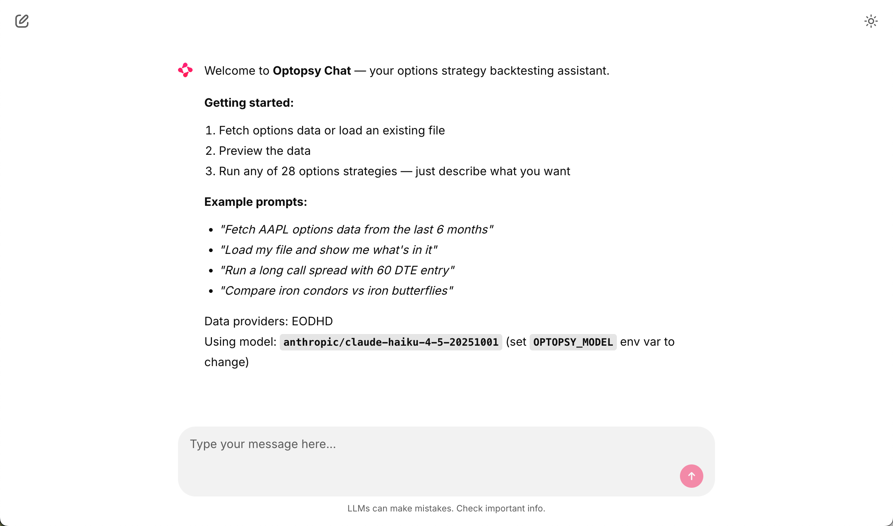

# AI Chat UI

Optopsy includes an AI-powered chat interface that lets you fetch data, run backtests, and interpret results using natural language.



## What it does

- Fetches historical options data via the [EODHD US Stock Options Data API](https://eodhd.com/financial-apis/options-data-api) (API key required)
- Runs any of the 38 built-in strategies via conversational prompts
- Explains results and compares strategies side by side
- Works with any OpenAI-compatible LLM (GPT-4o, Claude, Llama, etc. via [LiteLLM](https://github.com/BerriAI/litellm))

## Installation

```bash
pip install optopsy[ui]
```

## Configuration

Create a `.env` file with your API keys (see `.env.example`):

```
ANTHROPIC_API_KEY=sk-...   # or OPENAI_API_KEY for OpenAI models
EODHD_API_KEY=...
```

### Environment Variables

| Variable | Purpose |
|---|---|
| `ANTHROPIC_API_KEY` | LLM provider API key (default provider) |
| `OPENAI_API_KEY` | Alternative LLM provider |
| `OPTOPSY_MODEL` | Override model (LiteLLM format, default: `anthropic/claude-haiku-4-5-20251001`) |
| `EODHD_API_KEY` | Enable EODHD data provider for live options/stock data |
| `OPTOPSY_DATA_DIR` | Override base data directory (default: `~/.optopsy`). Cache, results, and database are stored here. |
| `DATABASE_URL` | PostgreSQL connection URL for conversation persistence (default: local SQLite) |

### Model Selection

Defaults to Claude Haiku 4.5 for its low cost and generous rate limits. To use a different model, set `OPTOPSY_MODEL` and the matching API key:

```
OPTOPSY_MODEL=gpt-4o
OPENAI_API_KEY=sk-...
```

## Launch

```bash
optopsy-chat
```

Your conversations are saved automatically and available in the sidebar. Fetched options data is cached locally so subsequent requests for the same symbol skip the API call.

### Launch Options

```bash
optopsy-chat run --port 9000 --headless --debug
```

## Cache Management

```bash
optopsy-chat cache size          # show disk usage
optopsy-chat cache clear         # clear all cached data
optopsy-chat cache clear SPY     # clear a specific symbol
```

## Conversation Starters

New chats display clickable quick-start prompts so you can jump straight into common workflows:

- **Backtest iron condors** on a specific symbol and date range
- **Compare spreads** side by side with different parameters
- **RSI-filtered strategies** with entry signal conditions
- **Simulate** a strategy with capital tracking and equity curve

## Chat Settings Panel

Persistent parameter controls are available via the settings gear icon. Changes apply to all subsequent prompts in the session:

| Setting | Description | Default |
|---------|-------------|---------|
| `max_entry_dte` | Maximum DTE at entry | 90 |
| `leg1_delta` | Target delta for primary leg | 0.30 |
| Slippage model | mid, spread, or liquidity | mid |

## Authentication

The Chat UI supports pluggable authentication via the [plugin system](plugins.md). Three auth types are available:

| Type | Description |
|------|-------------|
| `password` | Username/password login form |
| `oauth` | OAuth2 provider (Google, GitHub, etc.) |
| `header` | Header-based auth (reverse proxy, SSO) |

By default (no auth plugin), a local header-based auto-auth is used for single-user local access.

## Action Buttons

After a strategy runs, context-aware action buttons appear for quick follow-ups:

- **Toggle raw/aggregated** — Switch between summary stats and individual trades
- **Try wider DTE** — Re-run with a broader DTE range
- **Create chart** — Visualize the results

## Result Caching

Strategy results are automatically cached with content-based hashing. Running the same strategy with the same parameters skips re-computation. You can query cached results instead of re-running strategies:

- *"Sort the long_calls results by return"*
- *"Show me the top 5 DTE buckets from the last scan"*
- *"Filter to trades with profit_factor > 1.5"*

Results persist in `~/.optopsy/results/` across sessions.

## Multi-Series Charts

The `create_chart` tool supports comparing multiple metrics or strategies in a single visualization:

- **Multiple Y columns** — Plot metrics like `mean_return` and `win_rate` side by side
- **Group by** — Split data by category (e.g., strategy name)
- **Stacked or grouped bars** — Choose bar layout for comparisons
- **Cross-strategy comparison** — Use `data_source: "results"` to compare all strategies run in a session

## Example Prompts

- *"Fetch SPY options from 2024-01-01 to 2024-06-30 and run short puts with max 45 DTE, exit at 7 DTE"*
- *"Compare iron condors vs iron butterflies on SPY from 2023-06-01 to 2024-01-01 with 30 and 60 day max entry DTE"*
- *"Run short puts on SPY from 2024-01-01 to 2024-12-31 with RSI below 30 sustained for 3 days as the entry signal"*
- *"Simulate short puts on SPY with $100k capital and 2 max positions, then chart the equity curve"*
- *"Create a bar chart comparing mean return and win rate across all strategies I've run"*
